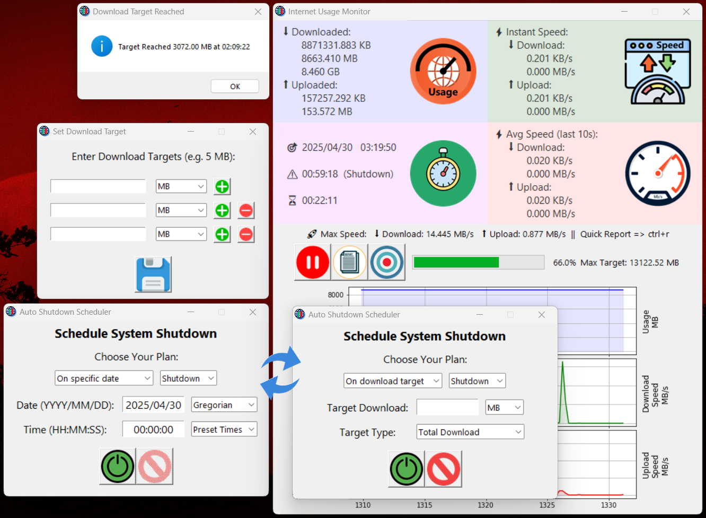

# Internet Usage Monitor 📶

A powerful and lightweight tool for real-time internet usage tracking, download goal management, and smart shutdown scheduling — all in an intuitive and user-friendly interface.

## 🔹 Features:
**📡 Real-Time Traffic Monitoring:** Instantly view live upload and download speeds.

**🎯 Target-Based Monitoring:** Set a specific download limit and receive notifications once it is reached.

**📑 Generate Usage Reports:** Save detailed reports of your internet activity in a text file.

**⏸️ Pause & Resume Tracking:** Control when monitoring starts or stops without closing the application.

**📈 Progress Visualization:** Track your download progress as a dynamic percentage relative to your target.

**🖥️ System Shutdown Scheduler:** Automatically schedule a shutdown, sleep, or hibernate action when reaching a target or at a specified time.

**🌐 Network Control:** Instantly disable or re-enable your Wi-Fi connection (admin access required).

**🛡️ Smart Admin Check:** Ensures that sensitive operations (like disabling Wi-Fi) are only executed with administrator permissions.

**👁️ Modern User Interface:** Clean, lightweight, and intuitive design optimized for ease of use.

## How to Use:

1. Run the application _(preferably as **Administrator** for full functionality)_.

2. Click the 🎯 "Set Target" button to define a download limit.

3. Monitor your network usage in real-time.

4. Get notified when your target is reached.

5. Optionally:

- Save a usage report by clicking 📄 "Report".

- Use the shutdown scheduler to automate system actions based on your conditions.

- Manage your network connection directly from within the app.

**License 📄**
This project is open for **personal use**. All rights reserved © MathLogix.

